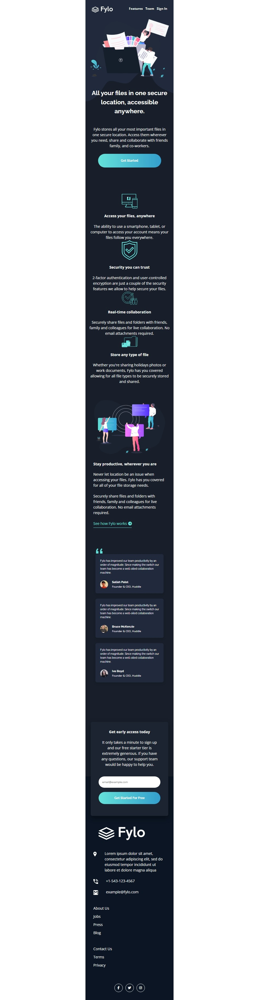
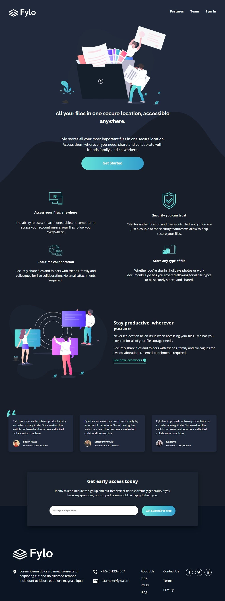
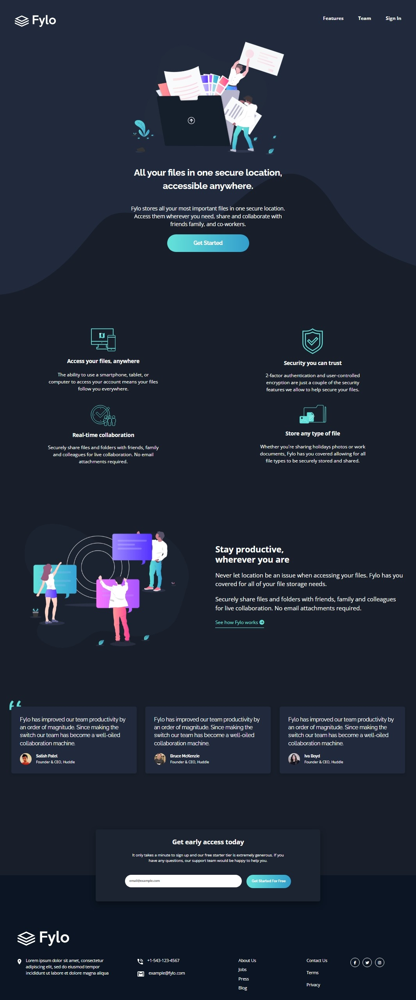
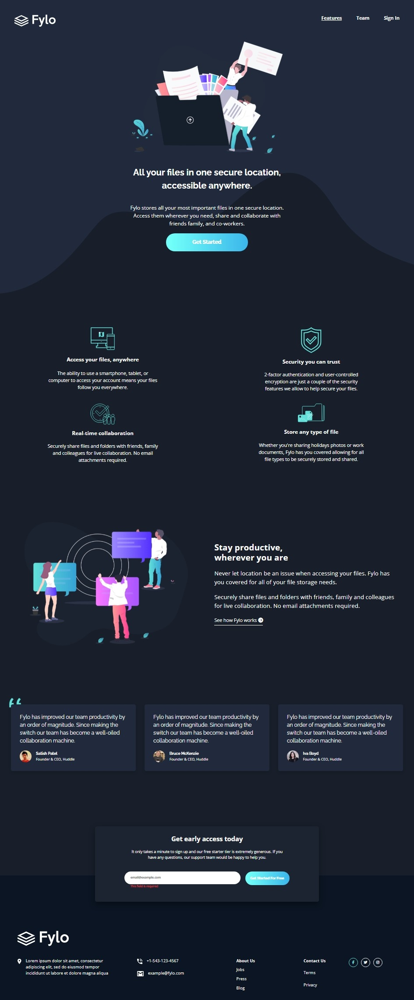

# Frontend Mentor - Fylo Dark Theme Landing Page

This is a solution to the [fylo-dark-theme-landing-page-master on Frontend Mentor](https://www.frontendmentor.io/challenges/fylo-dark-theme-landing-page-5ca5f2d21e82137ec91a50fd). Frontend Mentor challenges help you improve your coding skills by building realistic projects.

## Table of contents

- [Overview](#overview)
  - [Screenshot](#screenshot)
  - [Links](#links)
- [My process](#my-process)
  - [Built with](#built-with)
  - [What I learned](#what-i-learned)
  - [Continued development](#continued-development)
- [Author](#author)

## Overview

### Screenshot

Screenshots of the final project.

- Mobile design:



- Desktop design above 1024px:



- Desktop design above 1440px:



- Active states:



### Links

- Solution URL: [My Solution](https://github.com/gillaercio/fylo-dark-theme-landing-page-master)
- Live Site URL: [My Solution](https://gillaercio.github.io/fylo-dark-theme-landing-page-master/)

## My process

### Built with

- Semantic HTML5 markup
- CSS custom properties
- Flexbox
- CSS Grid
- Mobile-first workflow
- JavaScript

### What I learned

I used this project to practice:
- "**BEM methodology with HTML**"
- "**CSS Reset**"
- "**CSS Custom Properties (Variables)**"
- "**DOM Manipulation**"
- "**JavaScript Function Modularization**"

BEM (Block Element Modifier)

```html
<article class="feature-card">
  
  <h3 class="feature-card__title">Access your files, anywhere</h3>
  <p class="feature-card__description">
    The ability to use a smartphone, tablet, or computer to access your account means your
    files follow you everywhere.
  </p>
</article>
```

Reset CSS

```css
*,
:before,
:after {
  margin: 0;
  padding: 0;
  box-sizing: border-box;
}

html {
  font-size: 62.5%;
}

ul {
  list-style: none;
}
```

Variables

```css
:root {
  --Navy-850: hsl(217, 28%, 15%);
  --Navy-900: hsl(218, 28%, 13%);
  --Navy-950: hsl(216, 53%, 9%);
  --Navy-800: hsl(219, 30%, 18%);
  
  --Teal-200: hsl(176, 68%, 64%);
  --Cyan-500: hsl(198, 60%, 50%);
  --Red-500: hsl(0, 100%, 63%);
  
  --White: hsl(0, 0%, 100%);

  --raleway: 'Raleway', sans-serif;
  --open-sans: 'Open Sans', sans-serif;

  --text-title: 700 2.3rem/150% var(--raleway);
  --text-subtitle: 700 1.4rem/120% var(--open-sans);
  --text-nav: 700 1.2rem/150% var(--open-sans);
  --text-description: 1.4rem/150% var(--open-sans);
  --text-button: 700 1.2rem/150% var(--raleway);
  --text-testimonial: 1rem/150% var(--raleway);
  --text-card-name: 700 1.1rem/150% var(--raleway);
  --text-input: 1rem/150% var(--open-sans);
}
```

DOM

```js
//...
function handleSubmit(event) {
  event.preventDefault();

  clearError();

  const emailValue = emailInput.value.trim();

  if (!emailValue) {
    showError("This field is required");
    return;
  }

  if (!emailRegex.test(emailValue)) {
    showError("Please enter a valid email address");
    return;
  }

  showSuccess("Your email has been submitted successfully.");
  setTimeout(clearError, 2500);
  form.reset();
}
//...
```

Modularization

```js
//...
function showError(message) {
  errorMessage.classList.remove("input-success");
  errorMessage.classList.add("error-message");
  errorMessage.classList.add("input-error");
  errorMessage.classList.remove("sr-only");
  errorMessage.textContent = message;
  emailInput.classList.add("input-error");
}

function showSuccess(message) {
  emailInput.classList.remove("input-error");
  errorMessage.classList.remove("error-message");
  errorMessage.classList.add("input-success");
  errorMessage.classList.remove("sr-only");
  errorMessage.textContent = message;
}

function clearError() {
  errorMessage.textContent = "";
  errorMessage.classList.add("sr-only");
  errorMessage.classList.remove("error-message");
  errorMessage.classList.remove("input-success");
  emailInput.classList.remove("input-error");
}
```

### Continued development

I would to continue improving my **HTML**, **CSS** and **JavaScript** skills by building more responsive layouts and writing cleaner, more modular code.

## Author

- Frontend Mentor - [@gillaercio](https://www.frontendmentor.io/profile/gillaercio)
- Github - [My Github](https://github.com/gillaercio)
- LinkedIn - [My LinkedIn](https://www.linkedin.com/in/gildman-la%C3%A9rcio/)